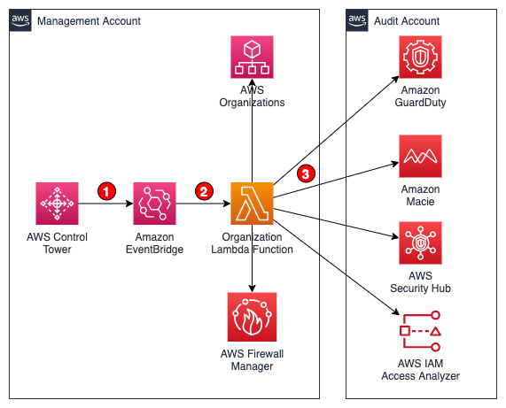

# Automate the set up of security services with AWS Control Tower

### Table of contents

1. [Introduction](#introduction)
2. [Architecture](#architecture)
3. [Prerequisites](#prerequisites)
4. [Tools and services](#tools-and-services)
5. [Usage](#usage)
6. [Clean up](#clean-up)
7. [Reference](#reference)
8. [Contributing](#contributing)
9. [License](#license)

## Introduction

This project configures the following [AWS Organizations](https://aws.amazon.com/organizations/) functionality:

1. Set up the [AWS Control Tower](https://aws.amazon.com/controltower/) "[Audit](https://docs.aws.amazon.com/controltower/latest/userguide/how-control-tower-works.html#what-is-audit)" account to be the [delegated administrator](https://docs.aws.amazon.com/organizations/latest/userguide/orgs_integrate_services_list.html) for:

- [Amazon GuardDuty](https://aws.amazon.com/guardduty/)
- [AWS Security Hub](https://aws.amazon.com/securityhub/)
- [AWS Firewall Manager](https://aws.amazon.com/firewall-manager/)
- [Amazon Macie](https://aws.amazon.com/macie/)
- [AWS Audit Manager](https://aws.amazon.com/audit-manager/)
- [AWS IAM Access Analyzer](https://aws.amazon.com/iam/features/analyze-access/)

2. Enables organizational sharing for [AWS Service Catalog](https://aws.amazon.com/servicecatalog/) and [AWS Resource Access Manager](https://aws.amazon.com/ram/) (RAM)
3. Optionally, configures an [AI opt-out policy](https://docs.aws.amazon.com/organizations/latest/userguide/orgs_manage_policies_ai-opt-out.html) at the organization root

## Architecture



1. When an [AWS Control Tower](https://aws.amazon.com/controltower/) landing zone is created, a [SetupLandingZone](https://docs.aws.amazon.com/controltower/latest/userguide/lifecycle-events.html#setup-landing-zone) event is sent to the [Amazon EventBridge](https://aws.amazon.com/eventbridge/) default event bus.
2. An Amazon EventBridge rule matches the `SetupLandingZone` event and triggers the `OrganizationSetup` [AWS Lambda](https://aws.amazon.com/lambda/) function.
3. The AWS Lambda function will coordinate the various services to set up the security operations account

## Prerequisites

- [Python 3](https://www.python.org/downloads/), installed
- [AWS Command Line Interface (AWS CLI)](https://docs.aws.amazon.com/cli/latest/userguide/install-cliv2.html) version 2, installed
- [AWS Serverless Application Model (SAM)](https://docs.aws.amazon.com/serverless-application-model/latest/developerguide/serverless-getting-started.html), installed
- [Docker Desktop](https://www.docker.com/products/docker-desktop), installed

## Tools and services

- [AWS SAM](https://aws.amazon.com/serverless/sam/) - The AWS Serverless Application Model (SAM) is an open-source framework for building serverless applications. It provides shorthand syntax to express functions, APIs, databases, and event source mappings.
- [AWS Lambda](https://aws.amazon.com/lambda/) - AWS Lambda is a serverless compute service that lets you run code without provisioning or managing servers, creating workload-aware cluster scaling logic, maintaining event integrations, or managing runtimes.
- [AWS Control Tower](https://aws.amazon.com/controltower/) - AWS Control Tower provides the easiest way to set up and govern a secure, multi-account AWS environment, called a landing zone.
- [AWS Organizations](https://aws.amazon.com/organizations/) - AWS Organizations helps you centrally manage and govern your environment as you grow and scale your AWS resources.
- [Amazon GuardDuty](https://aws.amazon.com/guardduty/) - Amazon GuardDuty is a threat detection service that continuously monitors for malicious activity and unauthorized behavior to protect your AWS accounts, workloads, and data stored in Amazon S3.
- [AWS Security Hub](https://aws.amazon.com/securityhub/) - AWS Security Hub gives you a comprehensive view of your security alerts and security posture across your AWS accounts.
- [Amazon EventBridge](https://aws.amazon.com/eventbridge/) - Amazon EventBridge is a serverless event bus service that you can use to connect your applications with data from a variety of sources.
- [Amazon Macie](https://aws.amazon.com/macie/) - Amazon Macie is a fully managed data security and data privacy service that uses machine learning and pattern matching to discover and protect your sensitive data in AWS.
- [AWS Firewall Manager](https://aws.amazon.com/firewall-manager/) - AWS Firewall Manager is a security management service which allows you to centrally configure and manage firewall rules across your accounts and applications in AWS Organizations.
- [AWS Service Catalog](https://aws.amazon.com/servicecatalog/) - AWS Service Catalog allows organizations to create and manage catalogs of IT services that are approved for use on AWS.
- [AWS Resource Access Manager](https://aws.amazon.com/ram/) - AWS Resource Access Manager (RAM) helps you securely share your resources across AWS accounts, within your organization or organizational units (OUs) in AWS Organizations, and with IAM roles and IAM users for supported resource types.
- [AWS Audit Manager](https://aws.amazon.com/audit-manager/) - AWS Audit Manager helps you continuously audit your AWS usage to simplify how you assess risk and compliance with regulations and industry standards.
- [AWS IAM Access Analyzer](https://aws.amazon.com/iam/features/analyze-access/) - IAM Access Analyzer helps you review existing access so that you can identify and remove unintended external or unused permissions.

## Usage

#### Parameters

| Parameter                |  Type  |         Default          | Description                                                                                                                                     |
| ------------------------ | :----: | :----------------------: | ----------------------------------------------------------------------------------------------------------------------------------------------- |
| Regions                  | String |        us-east-1         | Comma-delimited list of regions to enable for GuardDuty and Security Hub                                                                        |
| ExecutionRoleName        | String | AWSControlTowerExecution | IAM execution role in each new account                                                                                                          |
| AdministratorAccountName | String |          Audit           | Name of the AWS account to use for security operations                                                                                          |
| ExecutionCount           | Number |            1             | Increment value to re-execute OrganizationSetup Lambda function                                                                                 |
| EnableAIOptOutPolicy     | String |          false           | Optionally [opt-out](https://docs.aws.amazon.com/organizations/latest/userguide/orgs_manage_policies_ai-opt-out.html) of AI-service improvement |

#### Installation

The CloudFormation stack must be deployed in the same AWS account where the AWS Control Tower landing zone will be created. This is usually the AWS Organizations [Management](https://docs.aws.amazon.com/organizations/latest/userguide/orgs_getting-started_concepts.html#account) account.

```
git clone https://github.com/aws-samples/aws-control-tower-org-setup-sample
cd aws-control-tower-org-setup-sample
sam build
sam deploy --guided
```

## Clean up

Deleting the CloudFormation Stack will remove the Lambda function and EventBridge rule. All of the administrator delegations will not be removed.

## Reference

This solution is inspired by these references:

- [Why not Terraform?](https://www.linkedin.com/pulse/why-terraform-justin-plock/)
- [AWS Solutions Library - Customizations for AWS Control Tower](https://aws.amazon.com/solutions/implementations/customizations-for-aws-control-tower/)
- [AWS Deployment Framework](https://github.com/awslabs/aws-deployment-framework)
- [How to automate the creation of multiple accounts in AWS Control Tower](https://aws.amazon.com/blogs/mt/how-to-automate-the-creation-of-multiple-accounts-in-aws-control-tower/)
- [Enabling AWS IAM Access Analyzer on AWS Control Tower accounts](https://aws.amazon.com/blogs/mt/enabling-aws-identity-and-access-analyzer-on-aws-control-tower-accounts/)
- [Automating AWS Security Hub Alerts with AWS Control Tower lifecycle events](https://aws.amazon.com/blogs/mt/automating-aws-security-hub-alerts-with-aws-control-tower-lifecycle-events/)
- [Using lifecycle events to track AWS Control Tower actions and trigger automated workflows](https://aws.amazon.com/blogs/mt/using-lifecycle-events-to-track-aws-control-tower-actions-and-trigger-automated-workflows/)

## Contributing

See [CONTRIBUTING](CONTRIBUTING.md#security-issue-notifications) for more information.

## License

This library is licensed under the MIT-0 License. See the [LICENSE](LICENSE) file.
